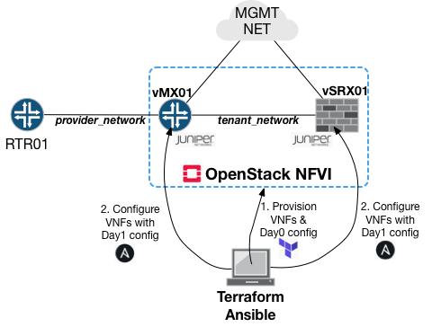

# Juniper vMX and vSRX provisioned on Openstack with terraform

## Table of Contents
+ [About](#about)
+ [Getting Started](#getting_started)
+ [Usage](#usage)
+ [Author](#author)

## About <a name = "about"></a>
Terraform scripts from this repo allow to deploy 1 instance of Juniper vMX router and 1 instance of Juniper vSRX (VNFs) interconnected together on Openstack NFVI. Management interfaces are placed in *management-instance*. Created VNFs have only **Day0** config - they are accessible over SSH but IP addressing is not assigned to interfaces, nor routing. Additional configuration is provisioned with *ansible*.

## Getting Started <a name = "getting_started"></a>

### Prerequisites
Following prerequisites must be met to run this tutorial (*tested environment*):
- [Terraform 0.11.13](https://www.terraform.io/downloads.html)
- [RedHat OSP 13](https://www.redhat.com/en/blog/red-hat-openstack-platform-13-here)
- [Juniper vMX 18.4R1.8](https://support.juniper.net/support/downloads/)
- [Juniper vSRX3 18.4R1-S2.4](https://support.juniper.net/support/downloads/)
- [Ansible 2.8.0](https://docs.ansible.com/ansible/latest/installation_guide/intro_installation.html)
- Openstack management network exists and is not created by terraform

### Limitions
> While Openstack doesn't enforce it networks/subnets MUST have unique names since data sources query these by names!

> Juniper vMX is deployed without [vMS-MCP](https://gbe0.com/networking/juniper/vmx/virtual-ms-mpc) which would require extra resources due to *performance mode* required for vFP. vMS-MCP card is mounted as USB drive for vFP and is required to use **NAT** on vMX - without it NAT will not work on vMX.


### Installing
After meeting the prerequsites the following information shall be obtained for terraform openstack provider:

|Parameter|Script parameter |Example value |
|---|---|---|
|OpenStack User Name |osp_user_name |admin  |
|OpenStack Project Name (Tenant) |osp_project_name |LAB | 
|OpenStack User Password  |osp_user_pass |****** |
|OpenStack Authentication URL  |osp_auth_url |http://192.168.0.1:5000/v3 |
|OpenStack Region   |osp_region |regionOne  |
|OpenStack Project Domain Name |osp_project_domain_name |default |
|OpenStack User Domain Name |osp_user_domain_name |Default  |


<br></br>
Generate public/private key-pair into *bootstrap_cfg* directory - it will be used to connect to both vSRX and vMX:
```shell-session
ssh-keygen -t ed25519
```

Install Ansible and required dependencies for Junos:
```shell-session
pip3 install -r ansible/requirements.txt
```

Install Junos ansible roles:
```shell-session
ansible-galaxy install Juniper.junos
```

Set appropriate credentials/openstack parameters/IPs/subnets/paths for software etc in *__terraform.tfvars__* file.

Likewise set appropriate values for remote IPs/ports/credentials in ansible files in *__ansible__* directory.

<br></br>
In case there are any existing resources on NFVI (e.g. VM images) then you need to import them to terraform state e.g.
```shell-session
terraform import module.vmx01.openstack_images_image_v2.VMX_VCP_IMG <VCP_IMG_UUID>
terraform import module.vmx01.openstack_images_image_v2.VMX_VFP_IMG <VFP_IMG_UUID>
terraform import module.vmx01.openstack_compute_flavor_v2.VMX_VFP_FLAV <VCP_FLAV_UUID>
terraform import module.vmx01.openstack_compute_flavor_v2.VMX_VCP_FLAV <VFP_FLAV_UUID>
```

### Architecture

* Scripts reuse concept of modules in terraform which also allows to deploy resources on a per module level. 
* Scripts are quite self explanatory, but basic terraform knowledge is required in order to be able to modify them.
* It deploys VNFs with **root** and **admin** users with access using the same public key
* Network between vMX and vSRX is a *__tenant__* network, while vMX is also connected to a single *__provider__* network



Description of main files:
```
.
[Infrastructure definition, module instantiation]
+-- main.tf 

[Variable definitions]
+-- variables.tf

[Variable assignments]
+-- terraform.tfvars 

[Modules definitions]
+-- modules

+-- ansible

[Ansible inventory]
|   +-- lab

[Ansible infrastructure definition]
|   +-- site.yml
```

## Usage <a name = "usage"></a>
### Deploy VNFs
Initialize terraform (it will preverify files, dependencies, download modules)
```shell-session
terraform init
```

Check what is the planned infrastructure
```shell-session
terraform plan
```

If planned infrastructure is fine then deploy it
```shell-session
terraform apply
```
*`Any resources created manually after this step must be also manually destroyed since infra state will not match the actual state`*
<br></br>
> Alternatively you can perform actions per module i.e.
* Upload VM images
```shell-session
terraform apply -target=module.img
```
* Create networking
```shell-session
terraform apply -target=module.net
```
* Create VMs
```shell-session
terraform apply -target=module.vsrx01 -target=module.vmx01
```
<br></br>
### Day1 config
When deployment is done configure basic IP addressing and configure MTU with Jinja2 templates.
```shell-session
cd ansible/
ansible-playbook -i lab site.yml
```
> Alternatively you can limit execution of a playbook to specific resources
```shell-session
cd ansible/
ansible-playbook -i lab site.yml -vvv --limit vsrx01
```

Connecting to vSRX and vMX can be done over SSH with
```shell-session
ssh -i <bootstrap_cfg/priv_key_name> <IP_ADDR>
```

**Clean Up**
>Anything created manually with **terraform apply** must be removed manually. When that is done destroy the infra as easy as
```shell-session
terraform destroy
```
>Resources can be destroyed per module as well (e.g. remove VNFs but keep images and networks)
```shell-session
terraform destroy -target=module.vmx01 -target=module.vsrx01
```


## Author <a name = "author"></a>
[LinkedIn](https://www.linkedin.com/in/mazurekmichal/)
<br></br>
[Website](http://www.stackblog.net/)


